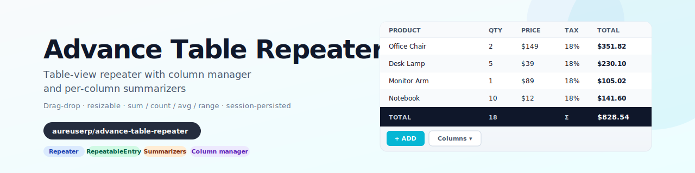

# Table Repeater for Filament v5

[](LICENSE.md)

An advanced [Filament v5](https://filamentphp.com) Repeater + RepeatableEntry that renders as a **table** with a column manager, drag-and-drop reorder, resizable columns, and per-column summarizers (sum / count / average / range).

<p align="center">
    <picture>
        <source media="(prefers-color-scheme: dark)" srcset="art/banner-dark.svg">
        
    </picture>
</p>

---

## Features

- **Table-view Repeater** (form) with per-column headers, resizable widths, drag-and-drop reorder
- **Table-view RepeatableEntry** (infolist) for read-only rendering with the same visual
- **Column manager** modal — toggle column visibility, persisted in session across reloads
- **Summarizers** — `Sum`, `Count`, `Average`, `Range` — rendered in a sticky footer
- **Hidden / required column markers** out of the box
- **Zero model coupling** — pure Filament infrastructure, reusable in any app
- **Full Pest test coverage**

---

## Requirements

- PHP 8.2+
- Laravel 11+
- Filament v5+

---

## Installation

```bash
composer require aureuserp/advance-table-repeater
php artisan filament:assets
```

The plugin auto-discovers via `extra.laravel.providers` and auto-registers in every Filament panel.

---

## Quick start

### Form — table-view Repeater

```php
use Webkul\AdvanceTableRepeater\Forms\Components\Repeater;
use Webkul\AdvanceTableRepeater\Forms\Components\Repeater\TableColumn;
use Webkul\AdvanceTableRepeater\Summarizers\Sum;

Repeater::make('order_lines')
    ->relationship()
    ->schema([
        Select::make('product_id')->relationship('product', 'name')->required(),
        TextInput::make('qty')->numeric()->required(),
        TextInput::make('price')->numeric()->required(),
    ])
    ->table([
        TableColumn::make('product_id')->label('Product')->resizable(),
        TableColumn::make('qty')->label('Qty')->markAsRequired(),
        TableColumn::make('price')->label('Price')->summarize(Sum::make()->label('Total')),
    ]);
```

### Infolist — read-only table

```php
use Webkul\AdvanceTableRepeater\Infolists\Components\RepeatableEntry;
use Webkul\AdvanceTableRepeater\Infolists\Components\Repeater\TableColumn;

RepeatableEntry::make('order_lines')
    ->table([
        TableColumn::make('product.name')->label('Product'),
        TableColumn::make('qty')->label('Qty'),
        TableColumn::make('price')->label('Price'),
    ]);
```

---

## API reference

### `Repeater` (forms) — extends `Filament\Forms\Components\Repeater`

| Method | Purpose |
|---|---|
| `->table(array<TableColumn> $columns)` | Switch rendering from default stacked layout to table layout |
| `->hasTableView()` | Check at runtime whether the repeater is in table mode |
| `->getTableColumns()` / `->getMappedColumns()` | Inspect columns |
| `->getSummaryForColumn(string)` / `->hasAnySummarizers()` | Summarizer introspection |

### `RepeatableEntry` (infolists) — extends `Filament\Infolists\Components\RepeatableEntry`

Same API as the form variant, plus:

| Method | Purpose |
|---|---|
| `->toEmbeddedTableHtml(array $record)` | Render a single row's table HTML for embedding (e.g. in mail templates) |

### `TableColumn` (forms variant) — fluent column definition

| Method | Purpose |
|---|---|
| `::make(string $name)` | Factory |
| `->label(string)` | Header label |
| `->hiddenHeaderLabel()` | Hide the header label while keeping the column |
| `->markAsRequired()` | Show a required asterisk |
| `->resizable(bool = true)` / `->isResizable()` | Enable drag-to-resize |
| `->wrapHeader(bool = true)` | Allow header text to wrap |
| `->getMinWidth()` / `->getMaxWidth()` | Width constraints |

### `TableColumn` (infolists variant) — simpler read-only column

`::make()` / `->label()` / `->hiddenHeaderLabel()` / `->isHeaderLabelHidden()`.

### Summarizers

| Class | Purpose |
|---|---|
| `Sum::make()` | Sum of column values |
| `Count::make()` | Row count |
| `Average::make()` | Arithmetic mean |
| `Range::make()` | min / max pair |
| `Summarizer` (abstract) | Extend to build your own |

All summarizers support `->label(string)` and render in the table footer.

---

## Theming & customisation

Stable CSS hooks:

- `.fi-fo-table-repeater` — outer wrapper
- `.fi-fo-repeater-item` — row
- `.fi-fo-table-repeater-actions` — action column
- `.fi-fo-summarizer` — footer totals row

Publish the Blade views to fork the table layout:

```bash
php artisan vendor:publish --tag="advance-table-repeater-views"
```

---

## Testing

```bash
vendor/bin/pest plugins/aureuserp/advance-table-repeater/tests/Feature
```

The suite covers architecture (base classes, trait usage, no debug calls), component instantiation, TableColumn fluent API, summarizer chainability.

---

## Publishing resources

```bash
php artisan vendor:publish --tag="advance-table-repeater-config"
php artisan vendor:publish --tag="advance-table-repeater-views"
```

---

## Troubleshooting

| Symptom | Fix |
|---|---|
| `Class Webkul\AdvanceTableRepeater\… not found` | `composer dump-autoload -o && php artisan optimize:clear` |
| Column manager modal doesn't open | Verify `public/css/aureuserp/advance-table-repeater/advance-table-repeater.css` exists; run `php artisan filament:assets` |
| Column visibility doesn't persist across reloads | Session driver must support writes (array driver loses state between requests) |
| Summarizers show blank | Confirm each `TableColumn` has a summarizer attached AND the column values are numeric |

---

## Security

Report vulnerabilities to `support@webkul.com`.

---

## License

MIT. See [LICENSE.md](LICENSE.md).
